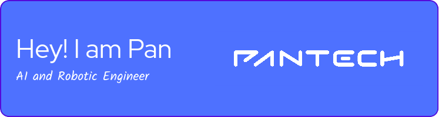

<h1 align="center">Pan — AI/ML Engineer & Robotics Developer 🤖</h1>

  I help startups and businesses ship <strong>production-ready AI solutions</strong> — 
  from computer vision pipelines to full robotics simulations, fast.

  
  
  

---

## 💡 What I Can Build For You

| Problem You Have | What I Deliver |
|---|---|
| 📦 Raw data, no insights | End-to-end ML pipeline + interactive dashboard |
| 🤖 Robot idea, no simulation | ROS2 simulation with SLAM, URDF & Gazebo |
| 📷 Need to detect/classify things | Custom computer vision model, deployed & ready |
| 🌐 IoT devices, no UI | Real-time Vue dashboard + Node-RED automation |
| 🚀 Idea, need an MVP fast | Working prototype in days, not months |

---

## 🧑‍💻 Freelance Services

### 🧠 AI & Machine Learning
- Predictive models (XGBoost, LightGBM, PyTorch, TensorFlow)
- Computer Vision (object detection, segmentation, classification)
- NLP pipelines & data processing
- Model deployment with FastAPI + Docker

### 🤖 Robotics (ROS2)
- Full robot simulation in Gazebo (URDF / SDF)
- SLAM, navigation stack, path planning
- Custom ROS2 nodes & sensor integration
- ROS2 + Python/C++ development

### 📊 Data & Dashboards
- Business intelligence & exploratory analysis
- Interactive Streamlit / Vue dashboards
- Automated reporting pipelines

### 🌐 IoT & Automation UIs
- Node-RED flows & MQTT integration
- Real-time monitoring dashboards (Vue + Bootstrap)
- Edge deployment & sensor pipelines

---

## 🚀 Why Work With Me

- ✅ **Full-stack AI** — from raw data to deployed model to UI
- ✅ **Robotics + ML** combo — rare skill set, real-world tested
- ✅ **Fast turnaround** — MVP-focused, no scope creep
- ✅ **Based in Thailand** — competitive rates, async-friendly across timezones
- ✅ **Clean, documented code** — you own it fully after delivery

---

## 🛠️ Tech Stack

**Languages**  

**AI & ML**  

**Robotics**  

**Frontend & IoT**  

---

## 🌟 Featured Projects

> 🔨 Projects being added — check back soon or [email me](mailto:pangineering@gmail.com) to see work samples directly.

| Project | Stack | Status |
|---|---|---|
| 🤖 Autonomous Robot Simulation | ROS2 · Gazebo · SLAM | Coming soon |
| 📊 IoT Monitoring Dashboard | Vue · Node-RED · MQTT | Coming soon |
| 🧠 Computer Vision Pipeline | Python · OpenCV · PyTorch | Coming soon |

---

## 📈 GitHub Stats

More stats

---

## 📫 Ready to Work Together?

**For freelance projects:**
- 🎯 [Hire me on Fastwork](https://fastwork.co/user/pan6415) ← quickest response
- 📧 [pangineering@gmail.com](mailto:pangineering@gmail.com) ← for custom/larger projects

**I'm open to:**
- One-off freelance projects
- Long-term collaboration
- Open source sponsorship
- Part-time consulting

---

  <strong>⚡ Currently available for new projects</strong> 
  <em>Typical response time: within 24 hours</em>

---

### ☕ Support My Open Source Work

If my projects have helped you, consider buying me a coffee — it keeps me building!

