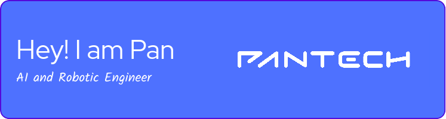

# 🧠 Pan Tech Prototype  
## From Idea to Prototype  
### "ไม่ต้องมีทีม Dev ก็สร้างหุ่นยนต์ / AI Prototype ได้"

---
### เทคโนโลยีที่เราใช้  

                                      
---
## 🎯 เหมาะกับใคร?
- Startup ที่อยากมี **POC / MVP** ไป Pitch
- เจ้าของไอเดียที่อยากทดลองระบบ AI หรือหุ่นยนต์
- ผู้ประกอบการที่อยากใช้เทคโนโลยีตรวจสอบธุรกิจ

---

## 🛠 บริการของเรา

### 🤖 Robotics & Simulation
- ROS2 + Gazebo  
- จำลอง environment จริง

### 🧠 AI / Machine Learning
- วิเคราะห์ข้อมูล + โมเดลต้นแบบ  
- สร้าง Dashboard / Demo UI

### 🌐 IoT Systems
- ESP32 + MQTT  
- ระบบเซ็นเซอร์ อ่านสดผ่าน Dashboard

### 🛠 ออกแบบสร้างหุ่นยนต์ ROS2
- ออกแบบระบบหุ่นยนต์ตัวจริง  
- สร้างต้นแบบควบคุมด้วย ROS2

---

## 📬 ติดต่อเรา  
✉️ **pan.techprototype@gmail.com**  
✅ แนะนำก่อนเริ่มฟรี

---

## 💡 Why Choose Us?
- เข้าใจ startup & การทำ Prototype  
- ส่งไฟล์ครบ พร้อม Demo และเอกสาร  
- ปรึกษา + แนะนำโครงสร้างก่อนเริ่ม ฟรี!
---

